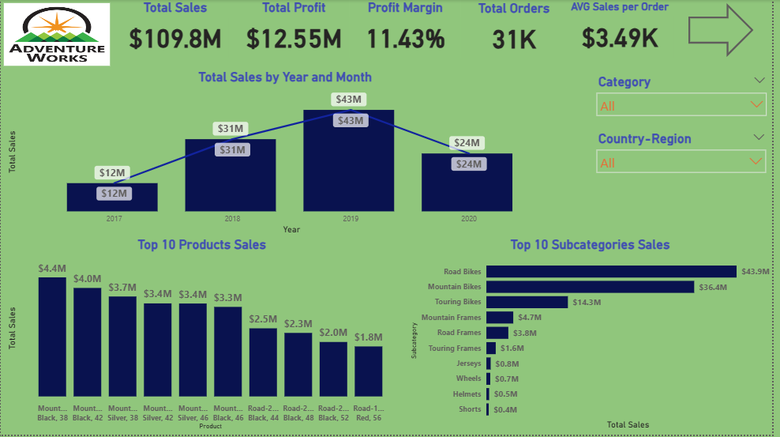
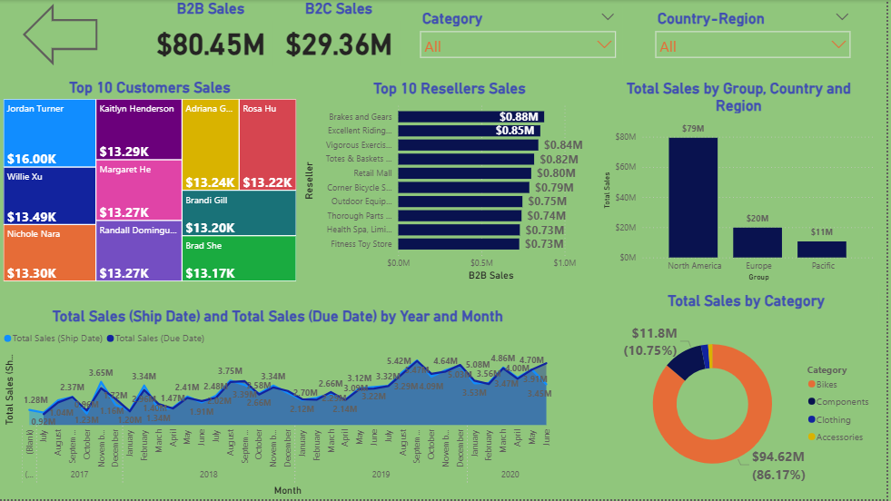

# 📊 Adventure Works Sales Dashboard – Power BI Project

Dashboard project for sales analysis using Power BI.

This project presents an interactive dashboard built using the Adventure Works dataset to provide insights into total sales, profit, product performance, and regional analysis.

---

## 📌 Dashboard Overview

The dashboard includes:
- Total Sales, Total Profit, and Profit Margin KPIs
- Sales Trends by Year and Month
- Top 10 Products and Subcategories by Sales
- Sales Analysis by Country, Region, and Sales Group
- B2B vs B2C Revenue Comparison
- Top Customers and Resellers
- Date-based trends (Ship Date vs Due Date)

---

## 🛠️ Tools Used
- Power BI
- Power Query
- DAX

---

## 🧠 Skills Demonstrated
- Data Cleaning & Transformation
- Creating Dynamic Visuals
- DAX Measures & Calculated Columns
- Syncing Slicers Across Pages
- Filtering and Interactions

---

## 📂 Dataset

The dashboard uses the built-in **Adventure Works** dataset, which includes:
- Product Category and Subcategory
- Total Sales, Profit, Orders
- Customer and Reseller Information
- Dates of Sale, Shipping, and Delivery
- Region, Country, Sales Group

---

## 📈 Key Insights

- Total sales reached **$109.8M**, with **$12.55M** in profit and an average order value of **$3.49K**.
- Peak sales were in 2019 with **$43M**, while a decline occurred in 2020.
- Top-performing product categories included **Road Bikes** and **Mountain Bikes**, generating over **$43M** and **$36M** respectively.
- **North America** led in regional sales with **$79M**, followed by Europe and Pacific.
- Resellers like *Brakes and Gears* and *Excellent Riding* were among the top contributors to B2B sales.
- Dynamic slicers allow filtering by **Category** and **Country-Region**, and are synced across all pages for consistency.

---

## 📊 Dashboard Screenshots

### 📄 Page 1 – Overall Sales View  

### 📄 Page 2 – Regional & Customer Insights  

---

## 👤 Author

**Mohammad Anwar Ahmed**  
*Data Analyst – BI Trainee at ITI*
